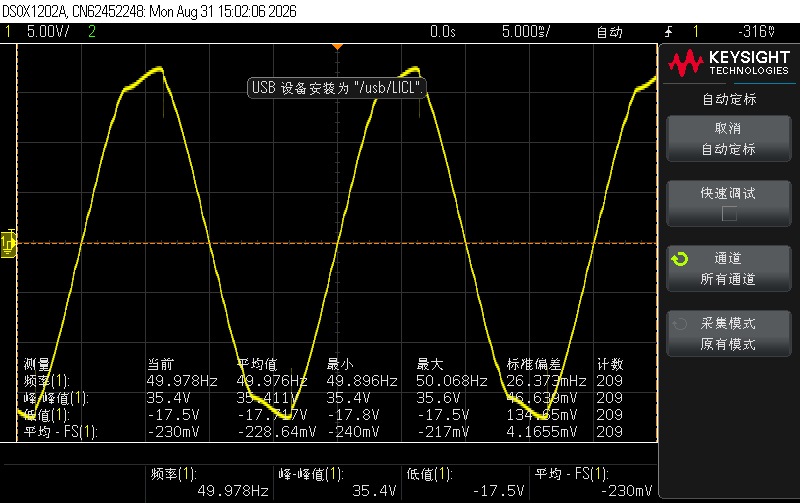
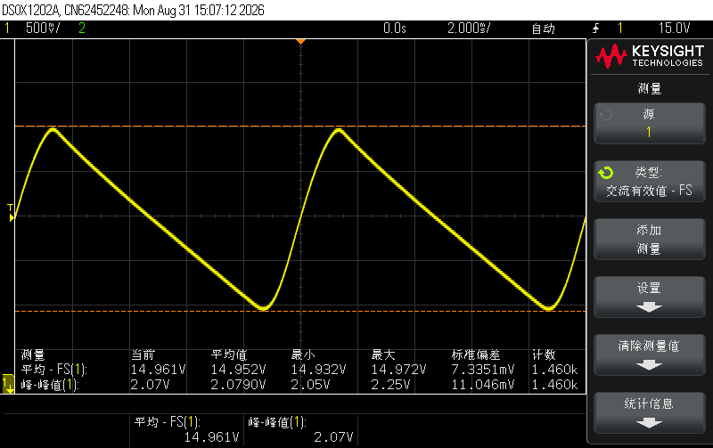

| 断开A后                                                      | 断开A前                                                      |
| ------------------------------------------------------------ | ------------------------------------------------------------ |
|  |  |
| 49.978Hz                                                     | 99.94Hz                                                      |
| U_pp 35.4V                                                   | U_pp 2.07V                                                   |
| U_rms 12.630V                                                | U_rms 14.930V                                                |

| 输入峰峰值 | 输出峰峰值 |
| ---------- | ---------- |
| 1.01V      | 6.37V      |

| 断开电压 | 连接电压 |
| -------- | -------- |
| 3.75V    | 4.23V    |

| U_max | 14.41 |
| ----- | ----- |
| U_min | 5.06  |
| 失效  | 11    |
|       |       |

